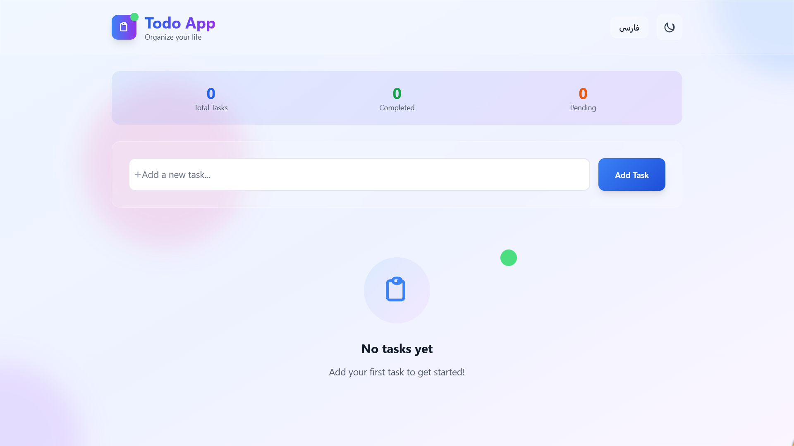
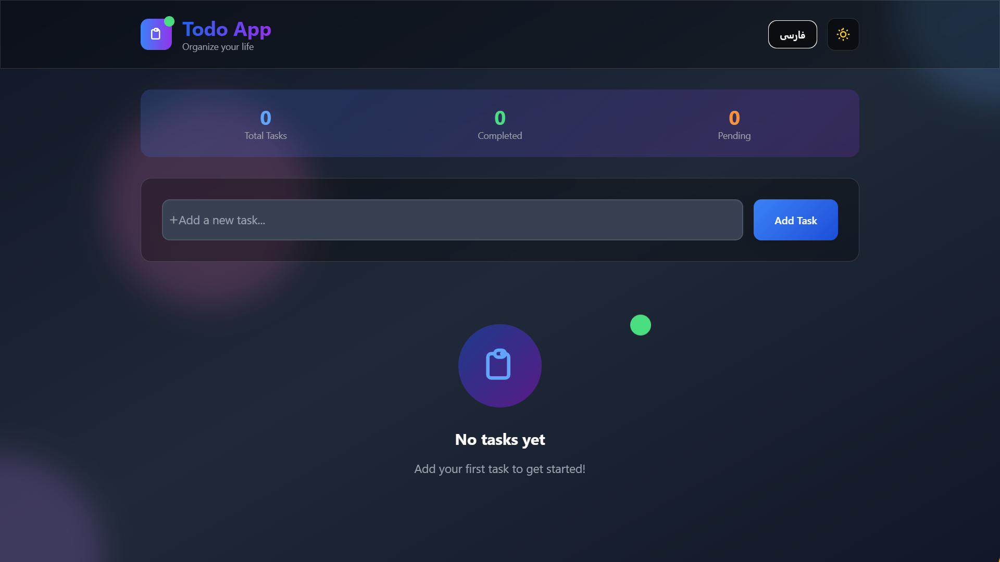

# Todo App - Python Learning Project

A simple Todo application built with Python Flask. This project is designed for learning Python and web development.

## 🌟 Features

- **Bilingual Support**: English and Persian
- **Theme Switching**: Dark and Light themes
- **Responsive Design**: Mobile and desktop friendly
- **Data Storage**: JSON file storage
- **Modern UI**: Built with TailwindCSS
## 🖼️ Screenshots

### 🔆 Light Mode


### 🌙 Dark Mode


## 🚀 Installation and Setup

### Prerequisites
- Python 3.7 or higher
- pip

### Installation Steps

1. **Download the project**
   ```bash
   git clone https://github.com/mahdikhakbazan/todo-web.git
   cd todo-app
   ```

2. **Create virtual environment**
   ```bash
   python -m venv venv
   # On Windows:
   venv\Scripts\activate
   # On Linux/Mac:
   source venv/bin/activate
   ```

3. **Install dependencies**
   ```bash
   pip install -r requirements.txt
   ```

4. **Run the application**
   ```bash
   python run.py
   ```

5. **Open your browser**
   Navigate to `http://localhost:5000`

## 📁 Project Structure

```
todo-app/
├── src/                    # Main source code
│   ├── main.py            # Main Flask application
│   ├── templates/         # HTML files
│   └── static/            # CSS and JS files
├── tests/                 # Test files
├── requirements.txt       # Python dependencies
├── run.py                # Application entry point
├── .gitignore           # Ignored files
├── LICENSE              # License file
└── README.md            # This file
```

## 🧪 Running Tests

```bash
pytest
```

## 🛠️ Development

### Running the application in development mode
```bash
python run.py
```

### Code quality check
```bash
flake8 src/
```

## 🎨 Application Features

### Language Switching
- Click the language button to switch between English and Persian
- Automatic text direction change (RTL/LTR)

### Theme Switching
- Click the sun/moon icon to change theme
- Settings are saved in browser

### Task Management
- **Add**: Type and press Enter or click "Add Task"
- **Complete**: Click the checkbox
- **Delete**: Click the trash icon

## 🐛 Troubleshooting

### Port already in use
```bash
# Change port in run.py
app.run(debug=True, port=5001)
```

### Tasks not saving
- Check file permissions for `tasks.json`
- Ensure write access to the directory

### Persian text not displaying
- Ensure browser supports UTF-8
- Check Vazir font loading

## 📄 License

This project is licensed under the MIT License.

## 🤝 Contributing

If you have questions or suggestions, please create a new issue.

---

**Built with ❤️ for learning Python**
